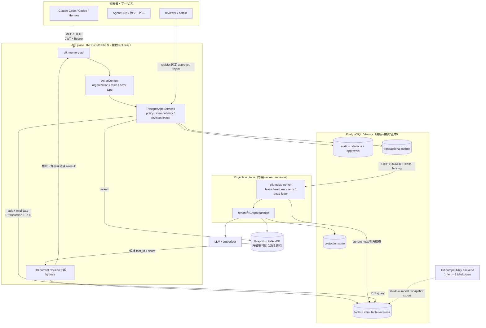

# plk-memory

ByteflareのAIエージェントとサービスが、組織の知識を安全に読み書きするためのメモリ基盤です。
税務・社会保険・法務・事業判断・社内ノウハウを、将来のセッションや別サービスから再利用できる形で管理します。

> [!IMPORTANT]
> 複数人・複数サービス向けのアーキテクチャは、PostgreSQLを更新可能な正本とする設計です。
> Git backendは既存Mac環境との互換性のために残しています。現在の実装状況とproduction gateは
> [PostgreSQL-primary設計書](docs/design/2026-07-10-postgres-primary-architecture.md)を参照してください。

## 全体像

設計の中心は、次の4点です。

- **正本はPostgreSQL**: factの変更をimmutable revisionとして保持し、RLSでorganizationを分離する
- **検索indexは派生物**: Graphiti/FalkorDBは候補検索だけを担い、結果は必ずDBのcurrent revisionで再検証する
- **書き込みと索引更新を分離**: DB transactionでoutboxまで確定し、独立workerがat-least-onceでGraphへ投影する
- **人間の承認内容を固定**: 共有知識への昇格はsource revisionを固定し、承認前に変わった内容はstaleとして拒否する



## 主要フロー

### 書き込む

1. JWTまたはBearer tokenから`ActorContext`を導出する
2. role、namespace、内容、secret、idempotency key、expected revisionを検証する
3. fact revision、current head、audit、outboxを同一transactionで確定する
4. workerがoutboxを取得し、DBのcurrent headをtenant別Graphへ投影する

Graphやモデルが停止していてもDBへの書き込みは継続します。索引更新はretryされ、上限到達後はdead letterへ移ります。

### 検索する

1. Graphiti/FalkorDBから候補のfact IDとscoreを得る
2. 候補をRLS配下のPostgreSQLから再取得する
3. current revision、status、namespace、organizationを再検証して返す

Graphは正本ではありません。停止時は検索だけが`degraded: true`になり、DBに保存された知識は失われません。

### 共有知識へ昇格する

1. `plk_propose_promotion`でdomain factのsource revisionを固定する
2. reviewerが`plk_decide_promotion`で承認または却下する
3. factが提案後に変更されていればstale、変わっていなければshared revisionとoutboxを同一transactionで作る

## Backend

| mode | 正本 | writer | 主な用途 |
|---|---|---|---|
| `postgres` | PostgreSQL / Aurora | 複数API replica | 組織運用、複数サービス、SQUEEZEへの逆輸入 |
| `git`（設定上の既定） | Git / Markdown | 単一プロセス | 既存Mac環境、小規模運用、互換性維持 |

Gitにファイルとして保存する構成は、人間が直接読み、レビューし、履歴を追える小規模運用には適しています。
一方、複数writerの同時更新、tenant分離、idempotency、低遅延APIが必要な組織runtimeではPostgreSQLを正本にします。

## 知識のモデル

1つのfactは、独立して無効化できる最小の主張です。主な要素は以下です。

| 要素 | 意味 |
|---|---|
| `statement` | 再利用する主張 |
| `why` | なぜ保持するのか、判断理由や根拠 |
| `how_to_apply` | どの状況でどう使うか |
| `kind` | `philosophy` / `logic` / `knowhow` |
| `namespace` | domain、shared、quarantineの適用範囲 |
| `source` | 一次情報、Notion ID、session IDなどの参照 |
| `status` | activeまたはinvalidated |

保存候補の最上位条件は、**将来どの状況で取得され、どの判断または行動をどう変えるかを具体的に説明できること**です。
説明できない過去の意思決定、現在構成、作業記録は、重要でもPLKではなく既存の設計書・ADR・Issue等に残します。
そのうえで、耐久性・確実性・既存SoTとの非重複・適用範囲・P/L/K分類・原子性の条件を満たす必要があります。
保存を提案するときは、`statement`・`kind`・`namespace`・新規／更新の別だけでなく、
**将来の取得状況**と、**取得しない場合と比べて変わる判断・行動**を示します。
完全な規約とnamespace定義は
[CONVENTIONS.md](https://github.com/cutsome/agent-organization/blob/main/knowledge/CONVENTIONS.md)が正本です。

## MCP tools

| tool | 役割 | 認可 |
|---|---|---|
| `plk_search` | 知識を検索する。PostgreSQL modeでは候補をDBで再検証する | read |
| `plk_add` | factを追加し、`supersedes`対象があれば同時に無効化する | write |
| `plk_invalidate` | 理由を記録してactive factを無効化する | write |
| `plk_history` | factの変更・revision履歴を取得する | read |
| `plk_status` | backend、Graph、同期またはoutboxの状態を確認する | read |
| `plk_propose_promotion` | sharedへの昇格proposalを作る | write |
| `plk_decide_promotion` | revision固定proposalを承認または却下する | reviewer / admin |

各クライアントには、税務・社保・法務・過去の意思決定・社内ノウハウに関する判断前に
`plk_search(reason="auto-guideline")`を一度呼ぶルールを配布します。

## 開発と運用

```bash
uv sync
uv run ruff check .
uv run pyright
uv run pytest -q
```

PostgreSQL modeでは、APIとindex workerを別credential・別processで起動します。migration、環境変数、
Git backendのlaunchd運用、縮退動作、トラブルシューティングは[運用ガイド](docs/OPERATIONS.md)に集約しています。

## リポジトリの境界

| repository | 役割 |
|---|---|
| **plk-memory** | API、MCP tools、PostgreSQL/Git adapter、worker、migration、設計・運用資料 |
| **agent-organization** | Git互換データ、PostgreSQL snapshot/export先、バリデータ、評価レポート |

## 現在地

PostgreSQL-primary runtimeとして、以下を実装済みです。

- tenant RLSとJWT actor context
- immutable revision、監査、relation、idempotency、optimistic concurrency
- transactional outbox、aggregate順序、lease fencing・heartbeat、retry・dead-letter
- tenant別Graph partitionとDB current-row rehydrate
- revision固定のpromotion proposal / approval / rejection / stale判定
- Git snapshotのshadow importとparity検証

production deployment前には、次の検証が必要です。

- 複数API replicaと複数workerの負荷・障害試験
- backup / restore、PITR、RTO / RPOの実証
- SQUEEZE staging AuroraでのRLS、IAM auth、migration検証

## Documentation

| 目的 | 参照先 |
|---|---|
| PostgreSQL-primaryの設計判断とproduction gate | [Architecture](docs/design/2026-07-10-postgres-primary-architecture.md) |
| セットアップ、起動、運用、縮退動作 | [Operations](docs/OPERATIONS.md) |
| GitからPostgreSQLへの移行手順 | [Migration](docs/MIGRATION.md) |
| 実測結果、既知の制約、設計変更履歴 | [Lessons](docs/LESSONS.md) |
| クライアント接続設定 | [Clients](clients/) |
| 過去のPhase記録と実装計画 | [History](docs/history/) |
