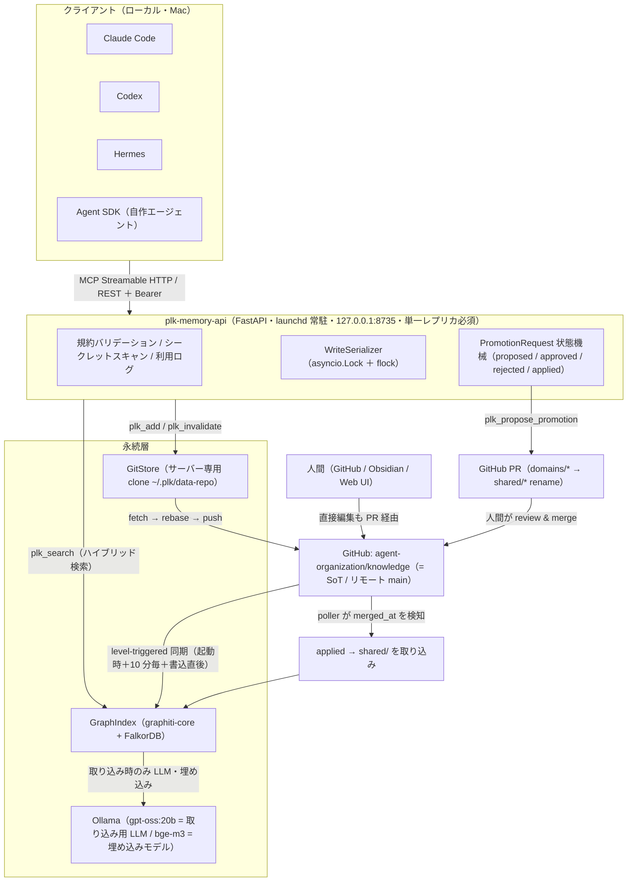
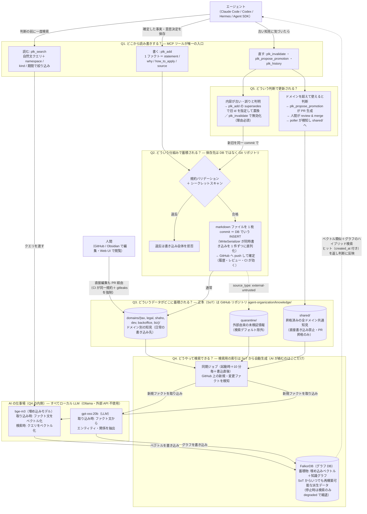

# plk-memory — Byteflare エージェント共通メモリ基盤（全体オーバービュー）

> 本書は plk-memory の **全体オーバービュー**。本書 1 枚で基盤の全体像・
> アーキテクチャ・規約・運用・現在地が分かるように書いてある。人間・AI エージェント・他ディレクトリから
> 参照するエージェントの共通入口。
> 最終更新: 2026-07-10（PostgreSQL-primary 基盤追加）

> [!IMPORTANT]
> 現在は移行期間中。既存 Mac ランタイムは Git-primary のまま動作する一方、
> 複数人・複数サービス向けの次期正本として PostgreSQL adapter、Alembic migration、
> transactional outbox、RLS を実装済み。新アーキテクチャと切替条件は
> [`docs/design/2026-07-10-postgres-primary-architecture.md`](docs/design/2026-07-10-postgres-primary-architecture.md) を参照。

## 1. これは何か

Byteflare のエージェント群（Claude Code / Codex / Hermes / 自作 Agent SDK）が読み書きする**組織メモリ基盤**。
現行は **Git を SoT（真実の源）**とする MCP メモリサーバー。次期構成では
**PostgreSQL を更新可能な正本、Git と検索インデックスを再構築可能な派生物**とし、
税務・社会保険・法務・過去の意思決定・社内ノウハウを蓄積し検索する。
1 人法人 Byteflare での実運用を通じて型（規約・namespace・昇格フロー・運用）とコードを検証し、
**コードごと SQUEEZE へ逆輸入できる複数 writer 基盤**として段階移行中。

## 2. アーキテクチャ全体図

Mermaid はテキストなので、この図はエージェントもそのまま構造として読める。ノード名は実装の実体名。

**フローの要点**: 書き込みは `plk_add` → バリデーション → シークレットスキャン → WriteSerializer で専用 clone に
commit → `fetch→rebase→push` で SoT（リモート main）へ。索引は SoT の差分を level-triggered で追随（宣言型ジョブ）。
昇格は `plk_propose_promotion` が PR を作り、人間が merge、poller が検知して `shared/` を ingest。
検索 `plk_search` は GraphIndex に対するハイブリッド検索（グラフ停止時は `degraded: true` で縮退）。

書き込み候補は「新しい確定事実」だけでは足りない。将来価値・耐久性・確実性・SoT非重複・
適用範囲・P/L/K分類・原子性の7条件を全て満たしたものだけを正規化し、提案前に `plk_search` で
重複・更新対象を確認する。候補がなければ PLK への保存質問自体をしない。完全な基準は
`agent-organization/knowledge/CONVENTIONS.md` を正とする。

### ユーザー目線の一枚絵 — 初見の 5 つの疑問に答える

上の構成図がコンポーネント視点なのに対し、こちらは**使う側（エージェント・人間）から見た動線**。
初見で気になる 5 つの疑問 — Q1 どこから読み書きする？ / Q2 どういう仕組みで蓄積される？ /
Q3 どういうデータがどこにある？ / Q4 どうやって検索できる？ / Q5 どういう判断で更新される？ —
に図のブロックがそのまま対応する。補足: Q1 の入口は `plk-memory-api`（`127.0.0.1:8735`・Bearer 認証）、
Q3 の SoT は GitHub `agent-organization/knowledge/`（kind = philosophy / logic / knowhow の 3 分類、§4 参照）。

## 3. 2 リポジトリの役割とランタイム配置

| リポジトリ | 役割 | 中身 | 公開 |
|---|---|---|---|
| **plk-memory** | **コード + 設計資料**（この基盤の実装と SoT ドキュメント） | FastAPI + MCP サーバー、GitStore / GraphIndex / 昇格 / 認証、`clients/`・`docs/`（本書・設計書・Phase 記録）・`scripts/` | GitHub `cutsome/plk-memory` |
| **agent-organization** | **データ + バリデータ** | `knowledge/`（1 ファクト 1 markdown = SoT）、`tools/validator`（規約 CI）、`reports/`（評価） | GitHub `cutsome/agent-organization` |

旧 `agent-memory` リポジトリ（設計資料）は本リポジトリに統合済み（`README.md`・`docs/design/`・`docs/history/`）。

**ランタイム配置（Mac 常駐期）**:

- `plk-memory-api`: FastAPI 単一プロセス。本番エントリ `plk_memory.app:create_prod_app`、`127.0.0.1:8735` bind、`workers=1` 固定。
- サーバー専用 clone: `~/.plk/data-repo`（人間の編集ディレクトリと物理分離。人間の編集は必ず GitHub 経由で取り込む）。
- 利用ログ: `~/.plk/usage.jsonl`。ログ: `~/.plk/logs/plk-memory.{out,err}.log`。
- 常駐: launchd（`deploy/com.byteflare.plk-memory.plist` → `~/Library/LaunchAgents/`）。
- 依存サービス: FalkorDB（Docker / OrbStack、`127.0.0.1:6379`）・Ollama（`localhost:11434`）。どちらか停止時は検索のみ degraded。

## 4. 書き込み規約の要点（規約 v1）

- **1 ファクト 1 ファイル**。markdown + YAML frontmatter。生データはコピーせず `source` に参照（URL / Notion ID / セッション ID）。
- frontmatter 必須フィールド: `id`（ULID・不変）/ `kind`（philosophy・logic・knowhow）/ `statement`（20〜200 字）/ `why`（20 字以上・定型文不可）/ `how_to_apply`（15 字以上・定型文不可）/ `source`（形式検証。tax・legal・shaho の knowhow（`decision` タグなし）は一次情報 https URL 1 件以上）/ `source_type`（user・agent・external-untrusted）/ `namespace`（ディレクトリと一致）/ `status`（active・invalidated）/ `written_by`（**サーバーがトークンから導出**・申告値は無視）/ `created_at` 他。
- **ディレクトリ = namespace**。`knowledge/shared/`（昇格済みのみ・**直接書き込み禁止**）／`knowledge/domains/{tax,legal,shaho,dev,backoffice,biz}/`／`knowledge/quarantine/`（`external-untrusted` 隔離・検索デフォルト除外）。
- 強制はツールレベル: `plk_add` がバリデーション・シークレット検知・上限で書き込み自体を拒否。人間の直接編集はデータリポジトリ CI（同一バリデータ + gitleaks）で同一規約を強制。
- **API 経由の `source_type` 上限は `agent`**（`user` は人間の PR 直編集のみ・CI 強制 = 記憶汚染の上方向偽装を遮断）。
- **kind の 3 分類（P/L/K）**: 分類軸は「規範か記述か × 変更権限」（規約 v1.1）。philosophy＝無条件の規範（変更は人間の承認必須、API追加は拒否しPR直編集のみ）／logic＝条件付きの規範（「X なら Y」という我々の決め方。**ドメイン固有でよい**）／knowhow＝記述（世界・制度・ツールの事実・手順。外部証拠で検証可能）。共有スコープとドメイン汎用性は namespace の軸であり kind の判定に使わない。意思決定の記録は knowhow ＋ `tags: [decision]`。定義と具体例は `CONVENTIONS.md`「kind の定義」を参照。
- 詳細は `../agent-organization/knowledge/CONVENTIONS.md`。

## 5. MCP ツールと検索動線

| ツール | 機能 | 認可 |
|---|---|---|
| `plk_search` | ハイブリッド検索（query, namespace[], kind, status, 期間）。Byteflare 既定は全 namespace（単一 group `plk-main`） | read |
| `plk_add` | 知見追加。`supersedes: [id]` で旧ファクト invalidate まで同一 commit でアトミック実行 | write |
| `plk_invalidate` | 無効化（`invalidation_reason` 必須 → frontmatter へ書き込み → commit ＋ グラフから削除） | write |
| `plk_history` | 変遷照会（frontmatter `id` をキーに。rename でも履歴が切れない） | read |
| `plk_status` | 索引鮮度（`last_ingested_commit` と HEAD の差）・未 push commit 数・件数・未処理 PromotionRequest 一覧 | read |
| `plk_propose_promotion` | PromotionRequest 作成 → GitHub PR 生成（push 完了がプリコンディション） | write |

- **検索動線**（作って使わない対策の中核）: 各クライアントの常駐指示（CLAUDE.md / AGENTS.md / SOUL.md）に 1 行を配布 —
  「税務・社保・法務・過去の意思決定・社内ノウハウに関わる判断の前に `plk_search` を一度呼ぶ（`reason="auto-guideline"` を付ける）」。
  `reason` で「自発（プロンプト誘導）／人間の明示指示」を利用ログで区別し、キル基準判定の対象を切り分ける。
- 全 MCP ツールは 60 秒以内応答（Codex `tool_timeout` 制約）。`/healthz` は即応（Codex の起動 10 秒ブロック対策）。

## 6. 運用コマンド早見

| 目的 | コマンド |
|---|---|
| ヘルスチェック | `curl -s localhost:8735/healthz` → `{"ok":true}` |
| 手動同期（SoT 差分を索引へ） | `curl -s -X POST localhost:8735/admin/sync -H "Authorization: Bearer $PLK_ADMIN_TOKEN"` |
| 索引再構築（group / 全体・非同期・実行中は書込 503） | `curl -s -X POST localhost:8735/admin/reindex -H "Authorization: Bearer $PLK_ADMIN_TOKEN"` |
| 常駐 起動 / 停止 / 再起動 | `launchctl bootstrap gui/$(id -u) ~/Library/LaunchAgents/com.byteflare.plk-memory.plist` ／ `launchctl bootout gui/$(id -u)/com.byteflare.plk-memory` ／ `launchctl kickstart -k gui/$(id -u)/com.byteflare.plk-memory` |
| Web UI（read 専用・cookie 認証・CSP） | ブラウザで `http://127.0.0.1:8735/`（ログイン `/ui/login`） |
| 月次キュレーションレポート | `uv run python scripts/curation/run_report.py`（`reports/curation/` に commit） |

## 7. 実績と現在地

- **Phase 0〜3 すべて完了**（2026-07-03）: 規約・CI（P0）→ ローカル PoC（P1）→ Mac 常駐・昇格フロー・Web UI（P2）→ 逆輸入パッケージ（P3）。
- **テスト 120 本 passed**（plk-memory HEAD `90393a0`）。昇格パイプは 1 往復実証済み（PR 作成 → CI green → 人間 merge → poller 検知 → applied → shared ingest）。全 4 クライアント実接続・検索疎通済み。
- **評価実測**（コーパス 23 件・完全ローカル・API 費用 $0）:
  - 素の埋め込み（bge-m3 cosine top5）: **20/20・MRR 1.000**（全て rank1）。
  - graph(triplet): 20/20・MRR 1.000（ただし実質「statement 埋め込み + RRF」でグラフ構造由来の付加価値ではない）。
  - graph(episode): 16/20・MRR 0.612（ローカル 20B の抽出を挟むぶんベースラインに負ける。品質下限条件）。
  - ripgrep 字句一致: 0/20（日本語口語クエリは空白を含まず 1 トークン化）。
  - ingest 壁時計: episode 280〜302 秒/件・triplet 126〜131 秒/件（$0・費用でなく時間が制約）。
- **グラフ層は 50 件まで凍結気味**: 小コーパス（〜50 件）では素の埋め込みで十分という一次所見。撤退ライン判定は**コーパス 50 件以上**で実施する取り決めで、23 件の数値は判定に使わない。マルチホップ・時間推論・50 件以上での再評価が次の判断材料。
- **EC2 移行は延期**: 既存の小規模 EC2（t4g.small 2GiB）はローカル LLM が載らず、全クライアントが 1 台の Mac 上にあるため実益が薄いと判明。Mac 常駐のまま運用し、EC2 移行は n8n 連携 or 組織展開 逆輸入直前に実施。

## 8. もっと知りたい人へ

パスはリポジトリルートからの相対。

| 知りたいこと | 参照先 |
|---|---|
| 設計判断の全体（目的・確定判断・ポート定義・逆輸入マッピング・Phase 表） | [`docs/design/2026-07-02-plk-memory-design.md`](docs/design/2026-07-02-plk-memory-design.md) |
| 敵対的レビューの記録（7 視点 52 指摘） | [`docs/design/2026-07-02-plk-memory-adversarial-review-log.md`](docs/design/2026-07-02-plk-memory-adversarial-review-log.md) |
| コードの使い方・セットアップ・縮退動作・常駐運用 | [`docs/OPERATIONS.md`](docs/OPERATIONS.md) |
| 組織展開 への移行手順・差分表・不変条件 | [`docs/MIGRATION.md`](docs/MIGRATION.md) |
| 実測バグ・数値・設計変更履歴・認証換装工数 | [`docs/LESSONS.md`](docs/LESSONS.md) |
| 検索精度・ingest・ベースライン対照の一次データ | [`../agent-organization/reports/phase1-eval-report.md`](../agent-organization/reports/phase1-eval-report.md) |
| 書き込み規約の完全版（バリデータ強制ルール） | [`../agent-organization/knowledge/CONVENTIONS.md`](../agent-organization/knowledge/CONVENTIONS.md) |
| クライアント接続テンプレート・検索動線 | [`clients/`](clients/) |
| 各 Phase の完了記録 | `docs/history/progress-phase{1,2,3}.md` |
| 実装計画書群 | [`docs/history/plans/`](docs/history/plans/) |
