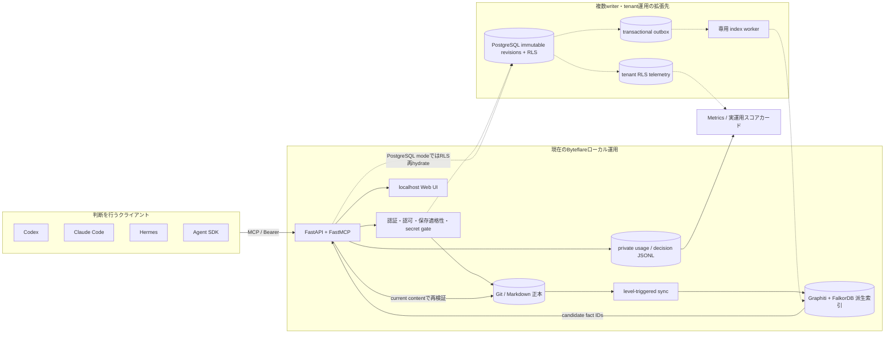

# PLK メモリ 現行ブループリント

> Status: current architecture source of truth
> Last verified: 2026-07-31
> Scope: Byteflare の現在のローカル運用と、PostgreSQL 組織運用への拡張境界

## 1. この文書の役割

この文書は「いま何が動いているか」と「将来どこへ拡張するか」を一枚にまとめる。
判断の優先順位は次の通り。

1. 実行中サービスの readback と現行コード
2. 本書
3. [`OPERATIONS.md`](OPERATIONS.md) と [`OPERATING_MODEL.md`](OPERATING_MODEL.md)
4. 日付付きの `docs/design/`（設計判断の履歴）
5. `docs/history/`（完了済みPhase・過去計画）

日付付き設計書に本書と異なる記述がある場合、履歴として読み、本書と現行コードを優先する。

## 2. 現在の運用プロファイル

2026-07-31の非秘密readbackでは、次の構成が稼働している。

| 項目 | 現在値 |
|---|---|
| 常駐 | macOS launchd `com.byteflare.plk-memory`、1 worker |
| API | `127.0.0.1:8735`、FastAPI + FastMCP |
| storage | `git` |
| 正本 | `agent-organization/knowledge/` のGit remote main |
| 認証 | client別Bearer token |
| 検索索引 | Graphiti + FalkorDB、`group_mode=single` |
| ingest | `triplet`、Ollama `gpt-oss:20b` + `bge-m3` |
| UI | localhost、readはpasswordless、writeは明示gate + session + CSRF |
| telemetry | private JSONL、検索previewは既定30日で削除 |
| クライアント | Codex / Claude Code / Hermes / custom agent用tokenを分離 |

この表は可変値を固定するための設定SoTではない。更新確認には以下を使う。

```bash
curl -sS http://127.0.0.1:8735/healthz
curl -sS http://127.0.0.1:8735/ui/api/metrics
launchctl print gui/$(id -u)/com.byteflare.plk-memory
uv run python -c 'from plk_memory.settings import Settings; print(Settings().storage_backend)'
```

## 3. 全体構成



現在の個人運用は実線、組織運用への拡張境界は破線で示す。PostgreSQL実装は存在するが、
現在の常駐サービスはGit backendであり、production cutover済みではない。

## 4. コンポーネントと責務

| 層 | 主な実装 | 責務 |
|---|---|---|
| composition | `app.py`, `composition.py` | REST / MCP / UIの結線とbackend選択 |
| tool surface | `mcp_tools.py` | MCP schemaと利用者向け契約 |
| Git application | `git_services.py` | Git backendの検索・書込・履歴・telemetry |
| PostgreSQL application | `postgres/application.py` | tenant scope、DB再hydrate、revision付き操作 |
| policy | `admission.py`, `policy.py`, validator | 保存適格性、namespace、role、secret、内容制約 |
| Git persistence | `facts.py`, `gitstore.py` | 1 fact 1 Markdown、commit/push、単一writer |
| PostgreSQL persistence | `postgres/repository.py`, Alembic | immutable revision、RLS、監査、idempotency |
| projection | `sync.py`, `postgres/worker.py` | Git差分またはoutboxを派生索引へ反映 |
| search adapter | `graphindex.py`, `postgres/graph_adapter.py` | Graphiti/FalkorDB候補検索とfact ID解決 |
| telemetry | `usage_log.py`, `postgres/telemetry.py` | searchとdecisionを分離記録 |
| evaluation | `scripts/eval/run_eval.py` | rg / 素の埋め込み / graphの同条件比較 |
| observability | `metrics.py`, `webui.py`, `static/` | 利用・貢献・品質・実運用ゲートの表示 |

## 5. 知識とSoTの境界

- PLKは「将来の取得で判断・行動を変える、安定した最小主張」を保存する。
- 会社の可変ファクトはNotion等の既存SoTへ置き、PLKには判断ルールとポインタだけを置く。
- 一般知識、法令の現行値、製品仕様など、一次情報を低コストで再取得できる内容は保存しない。
- `plk.shared`は直接書き込まず、revision固定のpromotionを経由する。
- `plk.quarantine`は既定検索から除外する。
- 検索索引とダッシュボードは派生物であり、正本ではない。

完全な保存規約は `agent-organization/knowledge/CONVENTIONS.md` を正とする。

## 6. ツールサーフェス

| tool | 読み書き | 役割 |
|---|---|---|
| `plk_search` | read | active factsを検索し、`search_id`と候補を返す |
| `plk_record_decision` | telemetry | ヒット検索が最終判断へ与えた観測影響を1回記録する |
| `plk_assess_candidate` | read | 保存適格性と重複候補を判定する |
| `plk_add` | write | 明示承認後にfactを追加・置換する |
| `plk_invalidate` | write | 履歴を残してactive factを無効化する |
| `plk_history` | read | revision / supersession / invalidation履歴を読む |
| `plk_status` | read | 索引鮮度・縮退・dead letter・promotion待ちを読む |
| `plk_propose_promotion` | write | domain factの共有昇格を提案する |
| `plk_decide_promotion` | reviewer/admin | revision固定proposalを承認・却下する |

## 7. 主要フロー

### 判断で使う

1. 対象判断の前に `plk_search(reason="auto-guideline")` を呼ぶ。
2. 返却内容を現行コード・一次情報・実データと突合する。
3. 最終判断直前に、ヒットした関連検索を1つの `plk_record_decision`へまとめる。
4. 未使用なら `effect=none` と理由を記録する。0ヒット検索は追加記録しない。

### 保存する

1. 候補を `plk_assess_candidate` へ渡す。
2. 再発性、将来の判断差分、検索代替性、既存SoT、証拠、原子性を確認する。
3. 重複・更新対象を確認し、previewへの明示承認を得る。
4. `plk_add`で追加し、必要なら`supersedes`で旧factを同時無効化する。
5. `plk_status`または再検索で索引追従をread backする。

### 改善する

1. Metricsで未計測、0結果、不採用理由、低観測採用factを確認する。
2. 同一runのrg / embed / graph評価で検索品質を比較する。
3. fact追加、表現修正、動線修正、検索層凍結のいずれかを選ぶ。
4. 変更後の同じ指標を比較し、結果が改善しなければ元に戻すか別案へ進む。

## 8. 障害時の不変条件

- Graph/Ollama停止時も正本への保存は継続し、検索は`degraded`を明示する。
- 検索indexの内容を正本として返さず、GitまたはRLS配下DBでcurrent stateを再検証する。
- telemetry障害は本来の回答を止めない。
- Git backendは単一writer、PostgreSQL backendはAPIとworkerのcredentialを分離する。
- 外部送信・削除・公開等の高影響操作はPLK検索結果だけで自動実行しない。

## 9. 現在の未完了境界

| 領域 | 現在地 | 完了条件 |
|---|---|---|
| 利用計測 | Codex中心、他clientのdecision記録が未定着 | 利用中clientすべてで7日計測率90%以上 |
| 価値証明 | 強い貢献は観測済みだが4週完全計測なし | 4完了週、毎週3件以上、計測欠損なし |
| 検索評価 | 評価履歴の定常実行が未定着 | 30日以内のrg/embed/graph同一run比較 |
| Graph採否 | 小コーパスの旧評価のみ | 現行コーパスでembedを継続的に上回る、または凍結 |
| PostgreSQL | 実装・local test済み、live cutover未実施 | staging RLS/IAM、負荷障害、backup/restore実証 |
| 復旧 | reindex runbookあり | 定期drillと復旧時間readback |

## 10. 更新契約

次の変更を行うPRは、本書とREADMEの該当箇所を同時に更新する。

- backend既定またはlive backendの変更
- 正本・索引・telemetry保存先の変更
- MCP toolの追加・削除・意味変更
- 認証・tenant境界・write gateの変更
- 運用ゲートまたはキル基準の変更
- Graph / embed / LLM構成の変更

日付付き設計書は履歴として上書きせず、冒頭に本書へのポインタを追加する。
