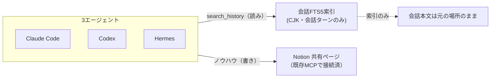
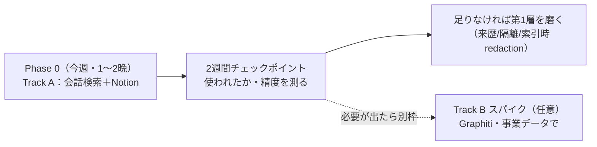

# 個人版 クロスエージェント・メモリ基盤 — 導入設計書（v3）

> 改訂: 2026-06-27（v3: 敵対的レビュー7視点を反映。戦略を「日常ツール」と「Graphiti学習/リハーサル」に分離）
> **読み方**: §1〜§5 だけで5分で要点と判断が分かります。§6〜§7 が今週作る本体。§8 以降は「触りたければ／いずれ事業で」の話。SQLやconfigは付録A。

---

## 1. 結論（先に言うと）

**この設計を一言で**: あなたの3つのAIエージェント（Claude Code・Codex・Hermes）の**過去会話を1つの検索で横断**できるようにし、**ノウハウは既にあるNotionに集約**する。これで日常の困りごとは今週解ける。

**v3 での最大の方針転換**:

- ❌ v2まで:「個人でテンポラル・ナレッジグラフ（Graphiti）を動かす＝事業リハーサル」を本命に据えていた。
- ✅ v3:**それは分離する。** 敵対的レビューの結論は「個人パイロットは事業の難所を踏まないので**リハーサルとしては弱い**。bi-temporalもソロでは遊ぶ」。
  - → **日常ツール（Track A）＝ 会話検索 ＋ Notion**。軽い・今週出せる・Graphiti不要。
  - → **Graphiti（Track B）＝ 別建ての"学習＋部分リハーサル"**。やる価値はあるが、**事業データ（複数テナント・同時書き込み）で・時間を区切って・事業展開が実際に決まった時に**やるのが正解。日常ツールをこれに依存させない。

**つまり今週の判断はシンプル**: Track A を作る。Graphiti は「触ってみたい」なら別枠の実験として切り出す（§8）。

---

## 2. いま決めること（5つ・推奨つき）

| # | 決めること | 推奨 | 理由 |
|---|---|---|---|
| **A** | まず何を作るか | **Track A だけ先行**（会話横断検索＋Notion集約） | 痛みは両方これで解ける。今週出せる |
| **B** | Graphiti をどうするか | **当面やらない／やるなら§8の別枠実験として** | 個人スケールでは過剰。事業が決まってから事業データで |
| **C** | 会話検索の置き場 | **ローカル `127.0.0.1`（常駐は不要、まずはCLIスキルでも可）** | 日常ツールはオフラインで即動くべき。EC2依存にしない |
| **D** | ノウハウ置き場 | **既存の Notion を使う（新DBを建てない）** | 3エージェントとも既にNotion MCPで繋がっている |
| **E** | 撤退ライン | **Phase 0 が2晩を超える／保守が月1時間を超えるなら、recall＋Notion で打ち止め** | ヤクの毛刈り（無限の作り込み）を防ぐ |

> この5つだけ決めれば動けます。残り（§6以降）は「なぜそうするか」と「将来の事業展開」の詳細。

---

## 3. 用語ミニ辞書（この後さらっと使うので先に）

| 用語 | 平たく言うと |
|---|---|
| **MCP** | AIエージェントに外部ツールを繋ぐ共通規格。「エージェント版USBポート」 |
| **stdio 接続** | エージェントが**毎回ツールを子プロセスとして起動**する繋ぎ方。各エージェントが別々に起動する＝共有1個にならない |
| **常駐デーモン / HTTP接続** | ツールを**1個のサーバーとして常時動かし**、全エージェントが同じURLに繋ぐ方式 |
| **REST** | ふつうのHTTP API。MCP非対応の自作ツールでも叩ける |
| **FTS5** | SQLite内蔵の全文検索。キーワード検索が速い |
| **CJK trigram** | 日本語/中国語を3文字単位で索引する方式。**これが無いと日本語がヒットしない** |
| **ナレッジグラフ** | 知識を「点（事実・人・物）と線（関係）」で持つDB |
| **bi-temporal（テンポラル）** | 各事実に「現実に起きた時刻」と「DBが知った時刻」を持たせ、**古い事実を消さず無効フラグで履歴を残す**方式。半年前はA、今はB、理由はC、を丸ごと辿れる |
| **provenance（来歴）** | その事実を「誰が・どこ由来で」書いたかのタグ。信頼の判定に使う |
| **redaction** | 秘密情報・個人情報を保存前にマスクすること |
| **単一writer** | 同時書き込みで片方が黙って消える事故（lost update）を防ぐ仕組み |
| **recall** | Claude Code/Codex の会話ログを日本語対応FTS5で索引する既存OSSツール |
| **Graphiti** | テンポラル・ナレッジグラフのエンジン（要グラフDB＋LLM） |

---

## 4. 登場するエージェント一覧

| エージェント | 何者か | どこで動く | この設計での扱い |
|---|---|---|---|
| **Claude Code** | あなたのCLI（Opus） | ローカル | クライアント（今すぐ繋ぐ） |
| **Codex** | あなたのCLI（gpt-5.5）。ネイティブMemoriesあり | ローカル | クライアント（今すぐ繋ぐ） |
| **Hermes** | 常駐パーソナルエージェント | ローカル | クライアント（今すぐ繋ぐ・凍結スナップショット注意） |
| **自作SDKエージェント** | あなたが書くPython等 | ローカル/別host | 将来クライアント（§8/§11） |
| **専用エージェント**（組織展開） | 顧客対応・製品組込 | Bedrock等・別環境 | **事業展開時のみ**（§11）。個人ツールには無関係 |
| **n8n 等** | ノーコード | 別host | 将来クライアント（RESTで） |

---

## 5. 痛み × 解決層 × Phase の1枚マップ

| 痛み | 性質 | 解決層 | 手段 | いつ |
|---|---|---|---|---|
| **①** 過去会話がCC/Codex/Hermesどこにあるか分からない | **読み取り** | 第1層：会話の横断検索 | FTS5（CJK trigram）＝recall土台 | **Phase 0（今週）** |
| **②** ノウハウが3エージェントに散る | **書き込み** | 第2層：共有ノウハウ | **既存のNotion**（全員MCP接続済） | **Phase 0（今週）** |
| （任意）テンポラルKGを学ぶ/事業の予行 | 書き込み・高度 | 別建て実験 | Graphiti（事業データで） | **Track B（§8・後日）** |

> **第1層＝読み・第2層＝書き**、性質が違うので**別々のストア・別ルール**にする（混ぜると"ゴミ箱化"する）。

---

## 6. Track A：今週作る個人ツール（これが実用の本体）

### 6.1 会話の横断検索（第1層）

**やること**: Claude Code・Codex・Hermes の過去会話を **1つのSQLite FTS5索引**にまとめ、`search_history(クエリ)` で全エージェントから日本語で引けるようにする。

**作り方**: ゼロから作らず **`recall`（CC＋Codex対応・CJK trigram・BM25・mtime増分）を土台**にし、**Hermes（state.dbのFTS5）を取り込むソースを足す**（半日程度）。配り方は2択：
- まずは **各エージェントのスキル/スラッシュコマンド**として入れる（常駐プロセス不要・最速）。
- 統一したいなら **1個のローカル常駐MCP（`search_history`）**にして3エージェントに登録（後述§9.4の単一writerが効くのは"書き込み"側で、検索は読み取りなので軽い）。

> ⚠️ **ここが厚生年金問題の肝（§7で実証）**: 会話ログ3.9GBの**約85%はツール出力・コードのノイズ**。生のまま索引すると検索が埋もれる。**ユーザー発言とアシスタント応答の"会話ターンだけ"を索引対象にする**（ツール結果・コード block は除外）。これをやらないと日本語検索が役に立たない。

### 6.2 共有ノウハウ（第2層）＝ 既存の Notion を使う

**やること**: 「他エージェントにも効く」と判断したノウハウを **既存の Notion の1ページ/DB**に集約する。3エージェントとも既に Notion MCP に繋がっているので、**新しいメモリサーバーを建てる必要がない**。

- **書き込み規約（3行で十分）**: `何を学んだか` ／ `なぜ（根拠・経緯）` ／ `どう使うか（適用条件）`。出どころも書く（生データはコピーしない）。
- ネイティブメモリ（Codex `~/.codex/memories`、CCプロジェクトメモリ、Hermes `MEMORY.md`）は**各エージェントのローカル下書き**として併存。Notion は**横断SoT**。

### 6.3 これで痛みは両方解ける

軽い・クラウド不要・オフライン可・既存資産の流用。**ここまでが"今週の本体"**。

---

## 7. 厚生年金シナリオで検証（end-to-end）

設計が「理屈倒れ」でないか、動機になった実例で通す。

**状況**: 「Byteflareの厚生年金を口座振替に切替」を相談（おそらくCodex側）。数週間後「進捗どうだった？」と聞く。

| 手順 | 起きること | 設計上の手当て |
|---|---|---|
| 1 | あなたがCC/Codexで `search_history("厚生年金 口座振替")` 相当を呼ぶ（スキル `/recall` か自然文トリガー） | 全エージェントに同じ索引を見せる |
| 2 | Codex の `~/.codex/sessions/` の数週間前のログがヒット**すべき** | **会話ターンのみ**索引＋**CJK trigram**で日本語が当たる |
| 3 | 「Codexで X日に相談、納付書→口座振替の申出書まで話していた」と分かる | recall は出どころ（どのセッション）も返す |

**正直な前提条件（これが無いと"理論上だけ"になる）**:
1. **会話ターンのみ索引**（ツール出力ノイズ85%を除外）。
2. **索引が最新**であること。Codex/Hermesは書き込みフックが無いので、**検索のたびに3つのセッションフォルダの差分(mtime)を上限つきで取り込む**（§9.5）。「常に最新」とは言い切らない。
3. ユーザーが**検索を呼ぶ動線**があること（`/recall` コマンド、または各エージェントのシステムプロンプトに「過去の話か怪しい時はまず `search_history` を引け」を1行入れる）。

> この3つを満たして初めて「あの話どこ？」が実際に解ける。v2まではここが曖昧だった。

---

## 8. Track B：Graphiti を触る（学習＋部分リハーサル・任意）

あなたが「テンポラルKGを一度自分で動かしたい」のは正当。ただし**何を買えて何を買えないか**を正直に。

### 8.1 これで手に入るもの（本物の価値）
- 接続契約（MCP/REST）の感触、**graphiti-core の運用感**（書き込み時LLMの単価・スキーマ適合）、グラフ検索の日本語精度、単一writerのSQLite機構。
- これらは「事業に出す前に触っておくと良い」要素ではある。

### 8.2 これで手に入らないもの＝**このパイロットが de-risk しない事業リスク**

| 事業の難所 | ソロパイロットで踏むか |
|---|---|
| マルチテナント分離（部署/顧客の越境防止） | ❌ 踏まない（1テナント） |
| 認証・認可（OAuth2.1/RBAC） | ❌ 踏まない |
| 昇格/承認フロー（部署→全社の人間レビュー） | ❌ 踏まない |
| 多人数・多エージェントによる汚染と競合 | ❌ 踏まない（1人） |
| 大規模なプロンプトインジェクション防御 | ❌ ほぼ踏まない |
| グラフ規模増大時のコスト（超線形） | ❌ ソロ単価は事業に外挿できない |

> 🚨 **最大の落とし穴＝false green**: 「ソロで快適に動いた」を「事業GOしてよい」と読み替えること。**ソロ成功＝事業GOではない。** 事業GOの前提は、別途**2テナント・同時書き込み・矛盾連鎖を仕込んだ分離PoC**を通すこと。

### 8.3 やるなら、こうやる
- **日常ツール（Track A）とは別プロセス・別DB**で。日常ツールをGraphitiに依存させない。
- **時間箱（2〜3日のスパイク）**として。`graphiti-core`＋FalkorDB＋自前FastAPI（MCP+REST 1プロセス）。
- できれば**事業相当のデータ**（複数テナント、同時writer、矛盾を仕込んだ系列）で測る。じゃないと「機能が遊ぶ」。
- **事業展開が実際に予定された時に**やる（その頃には graphiti/FalkorDB のバージョンも動いている）。
- turnkeyで早く触りたいだけなら **doobidoo/mcp-memory-service**（MCP+REST+OAuth入り・ただしKGではない）で配線の感触だけ先に得る手もある。

---

## 9. 安全に作るための前提（個人でも外せない）

「ソロだから緩くてOK」が**最大の誤り**。理由と最小の手当て。

### 9.1 ソロ ≠ 単一信頼ドメイン（汚染facts）
エージェントは**信頼できない外部内容**（Hermesが読んだWebページ、専用エージェントAが触る顧客メール、専用エージェントBへの製品入力）を取り込む。それが「事実」として書かれ、別エージェントがSoTとして信じる＝**記憶汚染**。重複検知は"似ているか"を見るだけで"悪意"は見抜けない（もっともらしい嘘は素通り）。
- **手当て**: 全factに**来歴タグ**（書いたエージェント・source種別`user/agent/external-untrusted`・source URI）。読み取りは既定で`external-untrusted`を除外。外部由来は**隔離namespace**（検索可・"未検証"フラグ・自動昇格しない）。

### 9.2 秘密情報は"索引時"にも漏れる
v2は「保存時にredaction」と書いたが、**会話ログとネイティブメモリを索引する側（第1層）は素通り**だった。しかも**既存ログ・既存メモリには既に秘密が入っている**（Codexメモリはgit管理、CLAUDE.mdは1Password/Notion ID参照）。
- **手当て**: ①**索引時にもredaction**（生バイトを `/search` から返さない）。②Presidio（PII）だけでなく**専用シークレットスキャナ**（gitleaks/trufflehog/detect-secrets）＋自前パターン（freee OAuth、`sk-ant-`、`tskey-` 等）。③**初回索引前に既存ストアを一度scrub**。④bi-temporalは消さないので**ハードデリート経路**を別途用意（漏れた鍵を履歴から物理削除できるように）。

### 9.3 「全書き込みHTTP経由」の正直な範囲
ネイティブ層（Codex/CC）は**デーモンを経由せず直接書く**。だから「全書き込みがHTTP API経由」は**デーモンのDBにのみ成立**する規約。ネイティブ層と会話ログは**"別系統の非信頼ソース"**として扱う（§9.1のタグ＋§9.2の索引時redactionを通す）。

### 9.4 単一writer（まず失敗の話から）
**失敗**: 2つのエージェントが同じノウハウを同時に書き換えると、後勝ちで片方が黙って消える（lost update）。常駐1プロセスでも非同期ハンドラが並走するので起きる。
**手当て**: 書き込みは**SQLite WALモード＋`BEGIN IMMEDIATE`**で1度に1writerに直列化、**version列の楽観ロック**（衝突したら409→再読込→再試行）で"消失"を"検出"に変える。観測ログ系は追記(INSERT)のみ。**全書き込みはデーモンのAPI経由・DBファイル直触り禁止**（直列化点を1か所に）。※詳細SQLは付録A。

### 9.5 落ちている時どうする（オフライン契約）
**手当て**: 各クライアントは**メモリを"あれば賢くなる"付加機能**として扱い、デーモン無応答時は**タイムアウト→素のまま続行**（graceful degradation）。日常ツール（Track A）は**ローカル`127.0.0.1`に置きオフラインで動く**。索引鮮度は**検索のたびに上限つきの差分取り込み**（例: L1のJITは上限500ms、超えたら古いまま返し非同期で追いつき"未更新"を明示）。「常に最新」とは言わない。

---

## 10. 段階導入（再見積もり・撤退ライン付き）

| 段階 | 成果物 | 完了条件 | 目安 |
|---|---|---|---|
| **Phase 0（今週）** | recall＋Hermes取り込み／会話ターンのみ索引／`/recall` か `search_history`／Notion共有ページ＋3行規約／既存ストアの初回secret scrub | 「厚生年金どこ？」が3エージェントから日本語で当たる | 1〜2晩 |
| **2週間チェック** | 利用ログ・日本語precision@5の実測 | 「実際に使ったか・当たったか」を数字で確認 | — |
| **磨き（必要時）** | 来歴タグ・隔離namespace・索引時redaction・ハードデリート | 秘密が `/search` から出ない／汚染を隔離できる | 数日 |
| **Track B（任意・別枠）** | §8。事業データでGraphitiスパイク | 事業の難所（分離・同時書き込み・矛盾）を測れる | 別途2〜3日 |

> **撤退ライン**: Phase 0 が2晩を超える、または保守が月1時間を超えるなら、**recall＋Notion のまま打ち止め**にして作り込まない。
> **正直な工数観**: フル構成（自前FastAPI＋graphiti＋FalkorDB＋品質ゲート＋3クライアント配線＋Hermes取り込み＋鮮度タイマー）は「3〜5日」ではなく**実質3〜6週間（片手間）**。だからTrack Aと分離する。

---

## 11. 事業展開への布石（今は読まなくてよい）

将来 組織展開/Byteflare で全社展開する時に**追加で必要**になるもの。個人版から"そのまま持ち上がる"部分と"新規に作る"部分を正直に分ける。

| 項目 | 個人版から持ち上がるか |
|---|---|
| 接続契約（MCP/REST のツール面） | ✅ そのまま（汎用MCP/RESTクライアントは無改修） |
| graphiti 運用知見・書き込み規約 | ✅ 持ち上がる |
| **マルチテナント分離・RBAC** | ❌ 新規（データモデルと全クエリのスコープが変わる） |
| **OAuth2.1（Auth0等）・監査** | ❌ 新規 |
| **昇格/承認フロー（Slack人間レビュー）** | ❌ 新規 |
| 専用エージェント | ❌ それぞれ専用経路の検証が要る |

**重要な注意**:
- **個人データと組織展開顧客データを同一EC2・同一DBに論理namespaceだけで混ぜない。** グラフのエンティティ解決が同名/同メール/同社で**越境マージ**しうる＋会社をまたぐデータフロー（DPA）問題。**物理的に別DB/別host・別鍵・越境エンティティ解決オフ**。
- **AgentCore Memory(boto3)は別ストア**。横断共有には 専用エージェントA が共有デーモンに書く必要（直接MCP or Gateway）。
- 「bindとauthを差し替えるだけ」は**汎用MCP/RESTクライアントに限った話**。上の❌項目は別物として扱う。

---

## 付録A 実装ノート（実装者・将来の自分向け）

- **3CLIのHTTP MCP登録**: Claude Code `~/.claude.json` `{"type":"http","url":".../mcp"}` または `claude mcp add --transport http`／Codex `~/.codex/config.toml` `[mcp_servers.x] url=`＋`bearer_token_env_var`／Hermes `~/.hermes/config.yaml` `mcp_servers.x.url:`＋headers。**3つとも既存Notion/Linearをremote HTTPSで接続中**（実証済）。stdioは3つともper-client-spawn（共有writerにならない）。
- **単一writer SQL**: `PRAGMA journal_mode=WAL; busy_timeout=5000; synchronous=NORMAL;`／書き込みは `BEGIN IMMEDIATE`／`UPDATE … SET value=?,version=version+1 WHERE id=? AND version=?`（0行→409）。会社ティアで真の複数host同時writerが出たらSQLite→Postgres（同じトランザクション＋version CASを再利用）。
- **トークン衛生**: bearerは**全クライアントでenv-var/secret-manager参照**（configにベタ書き禁止・同期/コミット対象から除外）、**期限＋デーモン側の失効リスト**をDay-0から。
- **監査ログ**: agent書き込み可能なSQLiteとは別に**追記専用/ハッシュチェーン**で持ち、`/search`・`/memories`から到達不可にし、定期的に箱外へ退避（侵害時に履歴を書き換えられないように）。
- **会話索引**: `recall`（CC+Codex、CJK trigram、BM25、mtime増分）＋Hermes `state.db` 取り込み。索引対象は**会話ターンのみ**（ツール出力・コード除外）。Codex実体は `~/.codex/sessions/`（`history.jsonl`/`logs_2.sqlite`は対象外）。
- **エンジン候補（Track B）**: 自前FastAPI＋`graphiti-core`（MCP+REST 1プロセス、要FalkorDB＋LLM/embedder、MCP SDK issue #1367 のlifespan配線注意）。turnkey代替＝doobidoo/mcp-memory-service。Graphiti同梱MCPはMCPのみ（RESTは別コンテナ）。
- **抽出（L2を自動で埋める場合）**: 生ログからの夜間抽出は**ゴミ生成器**になりやすい。**staging namespaceへ自動収集→日次/週次レビューで1タップ承認、未レビューはTTLで自動却下（自動承認はしない）**。パイプライン＋精度実測ができるまで**L2は手動書き込みのみ**。外部由来コンテンツは隔離し自動昇格しない。**抽出/embeddingはredaction後のテキストにのみ実行**（外部LLMへ生PII/顧客データを送らない／顧客namespaceはローカルモデル）。

## 付録B v1→v3 の経緯
- **v1**: stdio MCP一本化／単一stdioプロセス＝writer。→ **誤り**（stdioはper-client-spawnで単一writerにならない／自作・リモートエージェントに届かない）。
- **v2**: 一次サーフェスを「常駐デーモン＝Streamable HTTP MCP＋REST」に修正。クライアント種別表・サーバー側品質ゲート・公開ティアを追加。
- **v3（本書）**: 敵対的レビュー7視点を反映。**戦略を「日常ツール（Track A）」と「Graphiti学習/リハーサル（Track B）」に分離**。個人スケールでのKGは過剰と認め、事業リハーサルの限界（false green）を明記。セキュリティ（汚染facts・索引時の秘密漏れ・cross-org分離）、運用（オフライン契約・鮮度の正直化）、データ品質（会話ターンのみ索引・staging+レビュー）、可読性（結論先出し・用語辞書・トラック分離）を強化。

## 付録C リスクと「retireする/しない」対照
| リスク/事業の未知 | この設計で潰せるか |
|---|---|
| 過去会話が探せない（痛み①） | ✅ Track Aで潰す |
| ノウハウのサイロ化（痛み②） | ✅ Notion集約で潰す |
| 同時書き込みのlost update | ✅ WAL＋楽観ロック |
| 秘密/PII漏れ | ⚠️ 索引時redaction＋専用スキャナで低減（保証ではない）。ハードデリート併用 |
| 記憶汚染（外部由来poison） | ⚠️ 来歴タグ＋隔離で低減（完全防御は不可） |
| 事業のマルチテナント分離/承認/RBAC | ❌ **個人版では検証されない**（§8.2・§11）。別PoC必須 |
| グラフ規模コストの事業外挿 | ❌ ソロ単価は外挿不可 |
